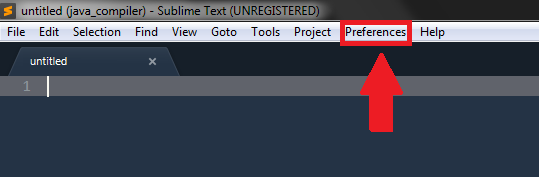
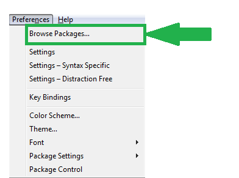
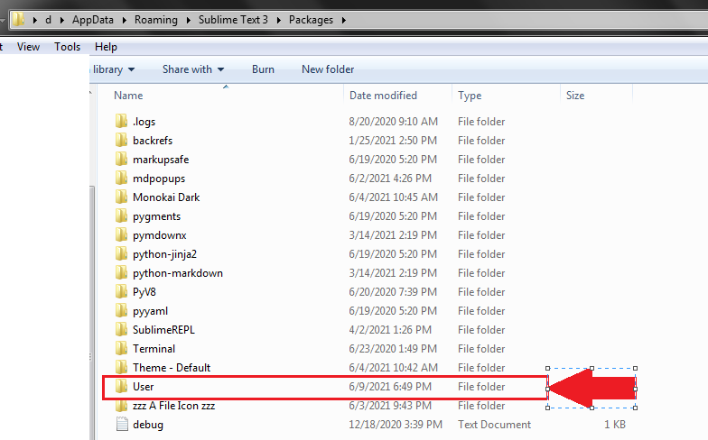
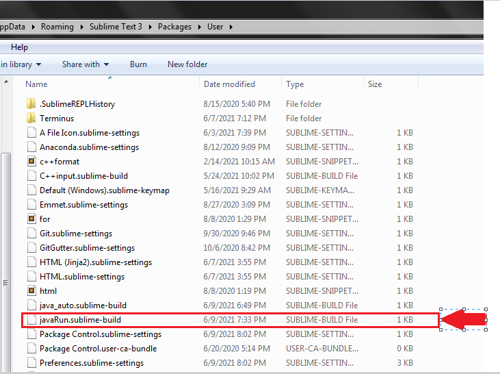
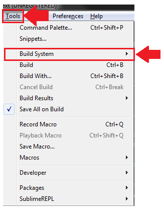
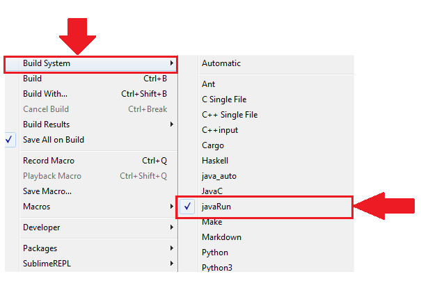

# java_compiler for sublime

## Introduction

This is the sublime build use to compile the java in windows pc. This sublime build is made for sublime text 3 for compiling the java file in the sublime.

## Pre-requirements:

- java developement kit : [click here!](https://www.oracle.com/java/technologies/javase-downloads.html) 
- set path variable of installed java 

### Tutorial on how to install and set path of java
[tutorial link](https://youtu.be/IJ-PJbvJBGs)
  

## How to setup JavaRun.sublime-build

- download this [repository](https://github.com/RohilPrajapati/java_compiler)
- copy the javaRun.sublime-build from downloaded repository
- click on Preferences tab in menu in sublime text 3 
    
- click Browse packages .. 
    
- after click that this interface will apperear: 
    
- click User folder
- paste the javaRun.sublime-build in that directory
 

## How to use javaRun.sublime-build

- open file with .java extension
- click on Tools tab of menu
- click on build system  
    
- choose the javaRun.sublime-build  
    
- use ctrl+b to compile and run the program

